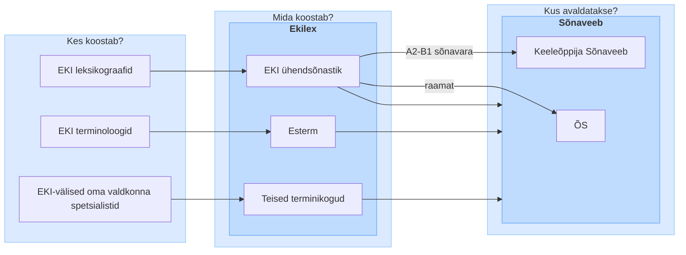

# Ekilex

Ekilex on Eesti Keele Instituudi infosüsteem, milles koostatakse ja hallatakse eesti keele sõnastikke ning terminikogusid. Süsteemi kasutavad EKI leksikograafid ja terminoloogid ning oma valdkonna eksperdid väljaspool EKI-t. Ekilexi sisu avaldatakse avalikult [Sõnaveebis](https://sonaveeb.ee).

See repositoorium sisaldab Ekilexi dokumentatsiooni.

